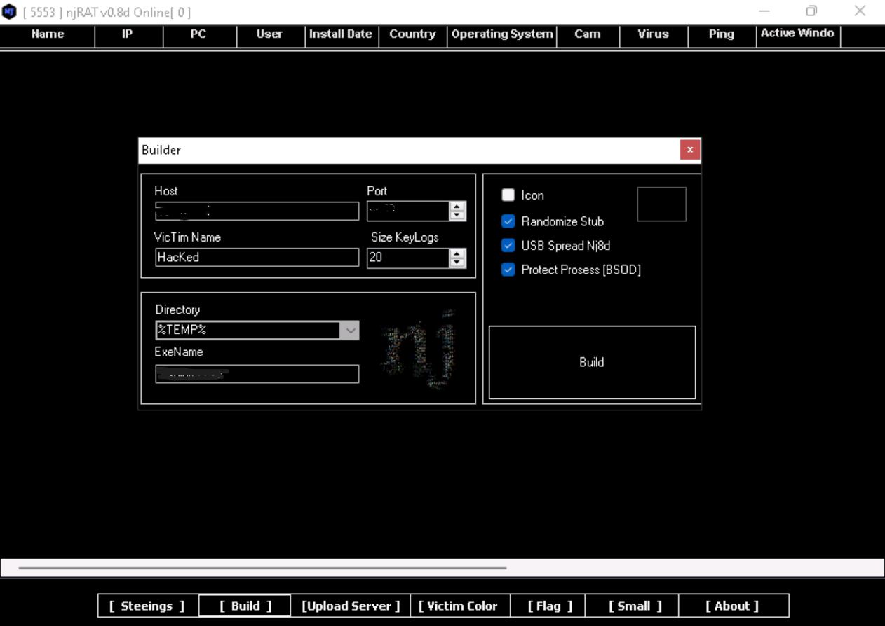

# Trojan Attack Documentation: Gaining Control Using njRAT

## Overview

In this project, I documented my experiment using the njRAT Remote Access Trojan to gain control over a victim machine (Windows Server 2022) from an attacker machine (Windows 11). This exercise helped me understand how RATs function in real-world scenarios, including how they connect, persist, and provide control to the attacker.

Remote Access Trojans (RATs) like njRAT allow attackers to stealthily control victim machines. Once the payload is delivered and executed, the attacker can access the machine remotely and perform a wide range of malicious tasks like keylogging, file manipulation, screen viewing, webcam spying, and more.

## Setup

- **Attacker Machine**: Windows 11
- **Victim Machine**: Windows Server 2022

## Steps I Followed

1. **Launched njRAT.exe** on the attacker machine. A `[Port Now]` pop-up appeared — I left the port as default and clicked OK.
2. The njRAT GUI appeared. I clicked the **[Build]** button in the bottom-left to start configuring the exploit.

3. In the Builder window, I:
   - Entered the IP address of my Windows 11 machine in the **Host** field.
   - Checked options: `Randomize Stub`, `USB Spread Nj8d`, `Protect Process [BSOD]`.
   - Left the rest of the options as default and clicked **Build**.
4. I saved and named the server file and used a phishing technique (e.g., via email) to send it to the victim.
5. Once the victim double-clicked the malicious server, the njRAT client on my attacker machine established a connection with their device.
6. The victim's info (IP, username, OS) showed up in my njRAT GUI.
7. I right-clicked the connected victim and explored available malicious actions.

## Right-Click Options (Explained)

- **Manager > File Manager**: Browse and manipulate files and folders on the victim’s system.
- **Manager > Process Manager**: View and manage active processes on the victim’s computer.
- **Manager > Remote Shell**: Get shell access to run commands directly on the victim machine.
- **Manager > Registery**: Read or modify Windows Registry keys remotely.
- **Manager > Microphone**: Turn on the victim’s microphone to spy on live audio.
- **Manager > Open Port**: Check for open ports on the victim’s device.
- **Manager > Get Passwords**: Steal stored credentials from the system.
- **Run File**: Execute a specific file on the victim’s system.
- **Remote Desktop**: Watch and control the victim’s desktop environment.
- **Remote Cam**: Spy through the victim’s webcam.
- **Keylogger**: Start logging all keystrokes to capture sensitive data.
- **Server**: Perform actions like update, uninstall, disconnect the RAT.
- **Open Cha**: Likely opens a chat session with the victim (depends on version).
- **Listview**: Visualize system activity or properties (custom views).
- **Dos Attack**: Launch a Denial of Service attack against the victim.
- **Open Folder**: Open specific directories on the victim’s machine.

## Persistence Behavior

- When the victim restarts their machine, njRAT temporarily loses connection.
- However, as soon as the victim logs back in, njRAT auto-reconnects, demonstrating persistence.
- The attacker can resume control without re-execution by the victim.

## Conclusion

This project demonstrated how njRAT can provide full GUI-based control over a remote system once infected. It gave me insights into how attackers exploit remote access malware for unauthorized control and showed the importance of endpoint protection and user awareness against social engineering.
